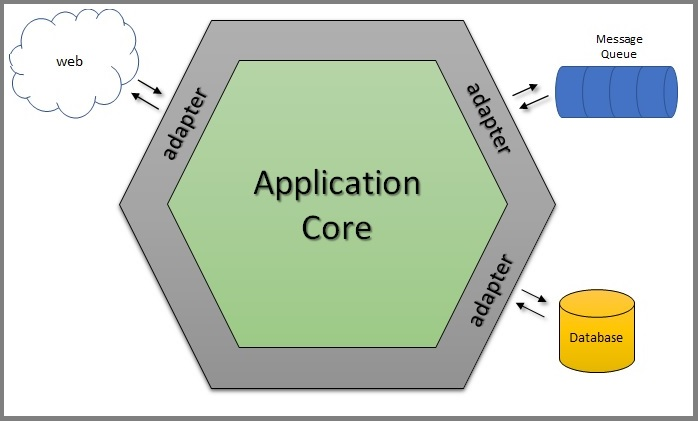

#  

## Atlas Mundi


[](https://bitbucket.org/beblue/marketplace-service/addon/pipelines/home)

> `atlasmundi-service` is responsible for provide features to atlasmundi app


### Endpoints

| Method | URI                                                                 | Auth           | Description                  | Response Status            |
|--------|---------------------------------------------------------------------|----------------|------------------------------|----------------------------|
| `POST` | [<u>`/login`](docs/payload/new-login.json)                          | `no`           | get token if account exists. | `201`, `202`, `422`, `500` |
| `POST` | [<u>`/v1/profiles`](docs/payload/new-account.json)                  | `Bearer token` | create an account.         | `201`, `202`, `422`, `500` |
| `GET`  | [<u>`/v1/profiles/{profilesId}`](docs/payload/get-profile-detail.json)|  `Bearer token`              | return a profile.          | `200`, `422`, `500`        |
| `PUT`  | [<u>`/v1/profiles/{profilesId}`](docs/payload/new-account.json)    |     `Bearer token`           | update an account.         | `200`, `422`, `500`        |
| `POST` | [<u>`/v1/profiles/{profileId}/invites/{inviteId}/accept`]()        |     `Bearer token`           | accept a invite.           | `201`, `422`, `500`        |
| `POST` | [<u>`/v1/profiles/{profileId}/invites/{inviteId}/refuse`]()         |    `Bearer token`            | refuse a invite.           | `201`, `422`, `500`        |
| `PUT`  | [<u>`/v1/profiles/{profileId}/location`](docs/payload/set-location.json)| `Bearer token`               | set last location profile. | `200`, `422`, `500`        |


#### `/login`
```json
{
  "token": "Bearer eyQweE5f==",
  "profileId": "2515afd9-b44d-41e2-82f0-8cd6bb75f22f"
}
```

### Constraints

| Name           | Description                                |
|----------------|--------------------------------------------|
| `UserNotFound` | UserAndPasswordNotFountException not found |


## Project architecture and organization
### Frameworks and technologies

* Java
* Spring Boot (WebFlux, Data JPA, Actuator)
* Spring Cloud (Sleuth, Stream, Vault, AWS)
* Flyway
* Gradle (Kotlin DSL)
* Java Money API
* Shedlock scheduler

# 

## How build and run

Environments available:
```bash
spring.profiles.active = staging
spring.profiles.active = production
```

```bash
./gradlew clean build

./gradlew composeUp

java -jar -Dspring.profiles.active=local build/libs/app.jar
```
## Contact information

* Pedro Gomes (pedrogomesup2@gmail.com)
* Mario Massari
